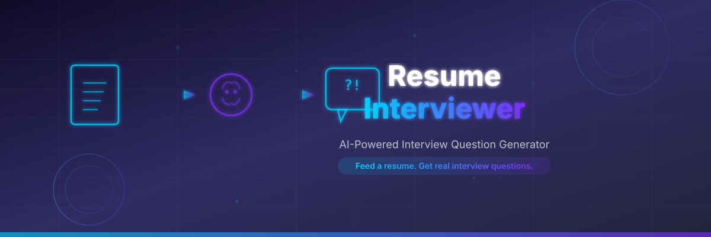
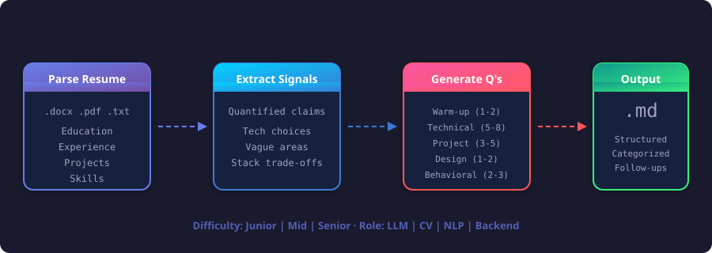
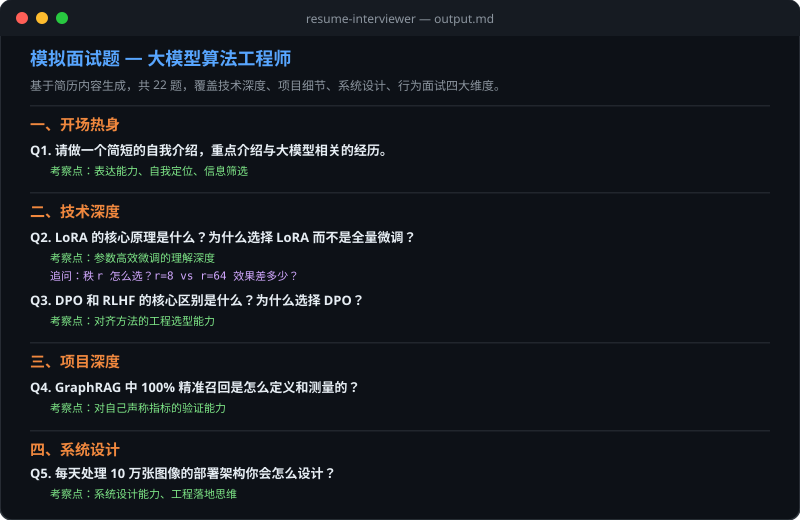

<!-- Banner -->
<p align="center">
  
</p>

<p align="center">
  <strong>AI-powered interview question generator from any resume</strong>
</p>

<p align="center">
  
  
  
  
</p>

<p align="center">
  📄 Feed a resume &nbsp;→&nbsp; 🧠 AI extracts signals &nbsp;→&nbsp; ❓ Get real interview questions
</p>

---

## What It Does

Feed it a resume (PDF, DOCX, or plain text), and it produces a **structured set of interview questions** that a real senior interviewer would ask — not generic questions, but ones tailored to the candidate's actual experience, tech stack, and project claims.

<p align="center">
  
</p>

## Features

<p align="center">
  
</p>

| Feature | Description |
|:---|:---|
| **Resume-Aware** | Every question is derived from actual resume content, not pulled from a generic question bank |
| **Follow-up Chains** | Each question includes 1-2 levels of follow-up probes to test real understanding |
| **Difficulty Tuning** | Junior / Mid / Senior levels adjust question depth and phrasing |
| **Role-Specific** | Auto-detects target role (LLM, CV, NLP, Backend...) and weights questions accordingly |
| **Answer Coaching** | Practice mode: answer one question at a time, get structured feedback with a 4-dimension rubric |
| **Bilingual** | Works seamlessly with both Chinese and English resumes |

## Demo Output

<p align="center">
  
</p>

## Question Categories

| Category | Count | What It Covers |
|:---|:---:|:---|
| Warm-up | 1-2 | Self-intro, project overview, motivation |
| Technical Deep-Dive | 5-8 | Concept verification, trade-off analysis, follow-up probes |
| Project Walkthrough | 3-5 per project | Architecture, your contribution, challenges, results |
| System Design | 1-2 | Scale up a resume project into a production system |
| Behavioral | 2-3 | Teamwork, failure recovery, learning ability |
| Reverse Questions | 2-3 | Smart questions to ask the interviewer |

## Quick Start

### 1. Install

```bash
# Via Codex CLI
codex skill install resume-interviewer

# Or clone manually
git clone https://github.com/YOUR_USERNAME/resume-interviewer.git \
  ~/.codex/skills/resume-interviewer
```

### 2. Use

Just ask Codex:

```
帮我根据简历生成面试题
```

```
Prepare interview questions from my resume at /path/to/resume.pdf
```

### 3. Options

```bash
# Specify difficulty
帮我生成高级难度的面试题
Generate junior-level interview questions from my resume

# Coaching mode (one question at a time with feedback)
我想练习面试，一次问一道题，我回答后你给我反馈

# Target a specific role
我投的是大模型算法岗，帮我生成针对性的面试题
```

## How It Works

```
Resume (PDF / DOCX / Text)
       │
       ▼
  ┌──────────┐     Extract: education, experience,
  │  Parse   │     projects, skills, metrics
  └────┬─────┘
       │
       ▼
  ┌──────────┐     Identify: quantified claims,
  │  Signal  │     tech choices, vague areas,
  │  Extract │     stack trade-offs
  └────┬─────┘
       │
       ▼
  ┌──────────┐     Apply: pattern templates,
  │ Generate │     difficulty scaling, role
  │  Q's     │     weighting, follow-up chains
  └────┬─────┘
       │
       ▼
  ┌──────────┐     Output: categorized Markdown
  │ Format   │     with hints, follow-ups, and
  │  & Ship  │     coaching rubric
  └──────────┘
```

## Project Structure

```
resume-interviewer/
├── SKILL.md                        # Core skill logic & workflow
├── README.md                       # You're reading this
├── LICENSE                         # MIT
├── assets/
│   ├── banner.svg                  # Project banner
│   ├── architecture.svg            # Pipeline diagram
│   ├── features.svg                # Feature cards
│   └── demo-output.svg             # Output preview
├── references/
│   ├── question-patterns.md        # Question taxonomy & generation rules
│   └── evaluation-rubric.md        # Answer scoring criteria (4 dimensions)
└── examples/
    └── sample-output.md            # Full 22-question example output
```

## Answer Coaching Rubric

In coaching mode, each answer is scored on 4 dimensions (1-5 each):

| Dimension | What It Measures |
|:---|:---|
| Completeness | Does the answer cover all key points? |
| Depth | Can the candidate explain "why", not just "what"? |
| Clarity | Is the answer well-structured and easy to follow? |
| Authenticity | Does it sound like real experience, not rehearsed? |

## Requirements

- [Codex CLI](https://github.com/openai/codex) or Codex Desktop
- Python 3.8+ (for `.docx` parsing)
- `python-docx` package (only for `.docx` files)

```bash
pip install python-docx
```

## Contributing

Contributions are welcome! Here's how:

1. Fork this repo
2. Create a branch (`git checkout -b feature/new-role-patterns`)
3. Add question patterns to `references/question-patterns.md`
4. Test with real resumes
5. Open a PR

### Adding New Role Patterns

Edit `references/question-patterns.md` and add a section following the existing format:
- Question template with `{placeholder}` syntax
- 2-3 concrete examples
- Generation rules (count, priority, difficulty)

## Star History

If you find this useful, give it a star so others can find it too!

<p align="center">
  <a href="https://star-history.com/#YOUR_USERNAME/resume-interviewer&Date">
    
  </a>
</p>

---

<p align="center">
  Built as a <a href="https://github.com/openai/codex">Codex Skill</a> — making interview prep personal, not generic.
</p>
